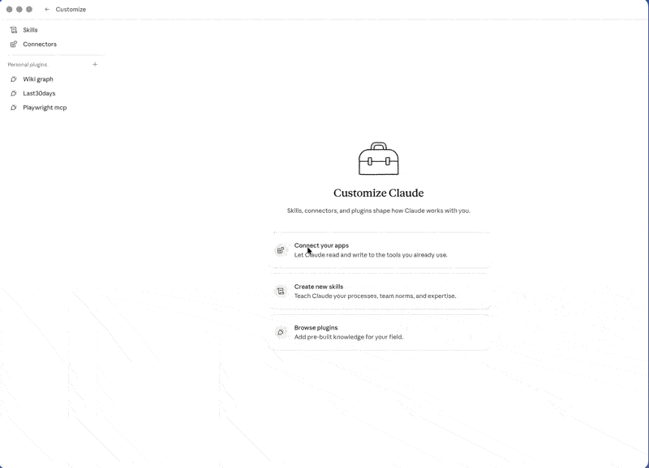

# Hacker News Plugin for Claude Code and Cowork



Read-only Hacker News tools as a plugin for Claude Code (CLI) and Cowork (Claude Desktop).

Adds a local Model Context Protocol server with tools for Hacker News search, stories, comment threads, users, favorites, active discussions, hiring threads, updates, and replies. No Hacker News account or API key required.

Repository: [m-ghalib/hackernews-claude-desktop](https://github.com/m-ghalib/hackernews-claude-desktop)

- Marketplace: `m-ghalib`
- Plugin: `hackernews`

## Install in Cowork (Claude Desktop)

1. Open the Claude Desktop app and click **Customize** in the sidebar.
2. Next to **Personal plugins**, click the **+** button.
3. Choose **Create plugin → Add marketplace**.
4. Paste the marketplace source and confirm:

   ```text
   m-ghalib/hackernews-claude-desktop
   ```

   If the shorthand is rejected, use the full URL:

   ```text
   https://github.com/m-ghalib/hackernews-claude-desktop
   ```

5. The **m-ghalib** marketplace now appears under Personal plugins. Open it.
6. Click the **+** next to the **Hackernews** plugin to install it.
7. The plugin's tools and the `set-default-username` skill are now available in any Claude Desktop conversation. If they do not appear, fully quit and reopen Claude Desktop.

## Install in Claude Code (CLI)

Add the marketplace:

```text
/plugin marketplace add m-ghalib/hackernews-claude-desktop
```

Install the plugin:

```text
/plugin install hackernews@m-ghalib
```

Restart Claude Code if prompted.

Verify the install:

```bash
claude plugin list
```

The `hackernews` plugin should appear under the `m-ghalib` marketplace.

## Update or remove

- **Update** (Claude Code): `/plugin marketplace update m-ghalib`
- **Update** (Cowork): open the marketplace under Personal plugins and reinstall.
- **Remove** (Claude Code): `/plugin uninstall hackernews@m-ghalib`
- **Remove** (Cowork): open the plugin under Personal plugins and remove it.

## Set your Hacker News handle (optional)

Tools that target a specific user (`get_user`, `get_user_favorites`, `get_replies_to_user`) require a `username` argument. To avoid passing it on every call, the plugin ships a `set-default-username` skill that captures your handle once per conversation and reuses it.

At the start of a session, tell Claude:

```text
My HN username is pg
```

After that, you can ask:

- `Analyze my Hacker News profile: karma, top 10 submissions, themes in last 50 comments.`
- `Show recent replies to me and summarize the sentiment.`
- `List my favorites grouped by domain.`
- `Search HN for my comments about Postgres in the last 90 days.`

The skill applies to that conversation only. Start a new conversation, set the handle again. To query a different user, name them explicitly ("show pg's recent comments").

## Tools

| Tool | What it does |
| --- | --- |
| `search` | Search stories, comments, jobs, polls, Ask HN, Show HN, domains, authors, and date ranges. |
| `get_item` | Fetch a story, comment, job, or poll by ID. Can include a bounded comment tree. |
| `get_user` | Fetch a Hacker News user profile. Can include recent stories and comments. |
| `list_stories` | List top, new, best, Ask HN, Show HN, or job stories. |
| `get_hiring_thread` | Fetch and filter monthly Who is Hiring, Who Wants to Be Hired, and Freelancer threads. |
| `get_updates` | Fetch recently changed Hacker News items and user profiles. |
| `get_user_favorites` | Parse a user's favorited stories from the Hacker News website. |
| `get_active_discussions` | Parse the Hacker News active page. |
| `get_replies_to_user` | Find recent comments that reply directly to a given user. |

## Troubleshooting

If the plugin does not load:

- Confirm `.claude-plugin/plugin.json`, `.claude-plugin/marketplace.json`, `.mcp.json`, and `dist/index.cjs` all exist at the repo root.
- In Claude Code, run `claude plugin validate .` from the repo root.
- Restart Claude Code or fully quit and reopen Claude Desktop.

## Maintainer

Build the bundled server and run tests:

```bash
npm install
npm run build
npm test
npm run test:network
```

## References

- [Plugins](https://code.claude.com/docs/en/plugins)
- [Plugin marketplaces](https://code.claude.com/docs/en/plugin-marketplaces)
- [Submit your plugin](https://claude.com/docs/plugins/submit)
